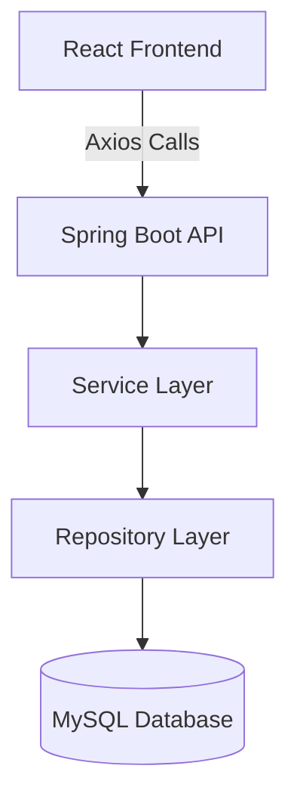

# 🚀 Employee Management App
A clean, modern, full‑stack application for managing employee records efficiently.  
**Built by Shaishav Parekh** • **Maintained by Shaishav Parekh**

---

# 🏷️ Badges

<p>
  
  
  
  
  
  <a href="https://github.com/Shivp55"></a>
</p>

---

# ✨ Overview

The **Employee Management App** is a full-stack CRUD system built with:
- **Spring Boot** for backend REST APIs
- **React** for a modern, smooth frontend interface
- **MySQL** as the database layer

Designed with a clean, modern UI and structured for scalability.

---

# 🧩 Features

- Add, update, delete and view employees  
- REST API with Spring Boot  
- Axios-based frontend integration  
- Modernized UI (tables, forms, buttons)  
- Search + filtering support  
- Modular folder structure  
- Backend–frontend decoupled architecture  

---

# 🏗️ Architecture



---

# 📁 Project Structure

```
Employee-Management-App/
│
├── react-frontend/            # React UI
│   ├── src/
│   │   ├── components/        # Pages & UI components
│   │   ├── services/          # API service
│   │   └── styles/            # Custom CSS
│   └── package.json
│
└── springboot-backend/        # Spring Boot server
    ├── src/main/java/         # Controllers, Services, Repositories
    ├── src/main/resources/    # Config
    └── pom.xml
```

---

# 🔗 API Endpoints

| Method | Endpoint | Description |
|--------|----------|-------------|
| GET | `/api/v1/employees` | Fetch all employees |
| POST | `/api/v1/employees` | Add new employee |
| GET | `/api/v1/employees/{id}` | Fetch by ID |
| PUT | `/api/v1/employees/{id}` | Update employee |
| DELETE | `/api/v1/employees/{id}` | Remove employee |

---

# ⚙️ Backend Setup (Spring Boot)

```bash
cd springboot-backend
mvn clean install
mvn spring-boot:run
```

The backend runs on:

```
http://localhost:8080
```

---

# 💻 Frontend Setup (React)

```bash
cd react-frontend
npm install
npm start
```

Frontend URL:

```
http://localhost:3000
```

If Node 20+ gives an OpenSSL error:

```bash
export NODE_OPTIONS=--openssl-legacy-provider
```

---

# 🖼️ Screenshots (Add your images later)

```
/screenshots
   ├── employees-table.png
   ├── update-form.png
   ├── view-employee.png
   └── dashboard.png
```

---

# 🛠️ Build for Production

**Frontend**

```bash
npm run build
```

**Backend**

```bash
mvn package
```

---

# 🤝 Contributing

Pull requests are welcome.  
For major changes, open an issue first.

---

# 🧑‍💻 Author & Maintainer

**Built by Shaishav Parekh**  
**Maintained by Shaishav Parekh**

GitHub: https://github.com/Shivp55

---

# 📜 License

MIT License © 2023  
Footer: **Employee Management App • Built & Maintained by Shaishav Parekh**
